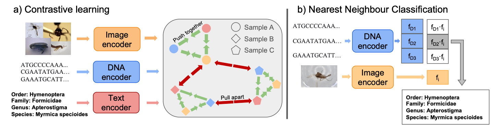
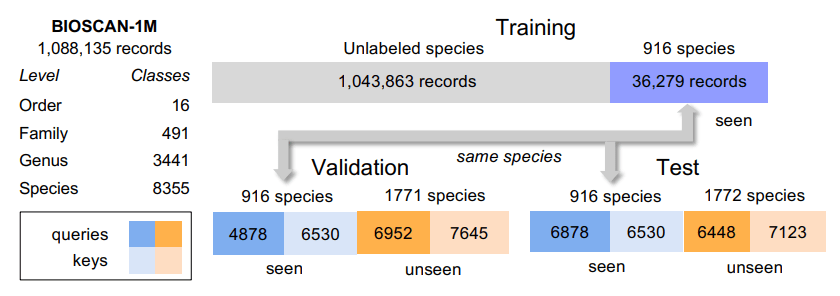

# BIOSCAN-CLIP
This is the official implementation for "BIOSCAN-CLIP: Bridging Vision and Genomics for Biodiversity Monitoring at Scale".

Links: [website](https://3dlg-hcvc.github.io/bioscan-clip/) | [paper](https://arxiv.org/abs/2405.17537)

# Overview

Taxonomically classifying organisms at scale is crucial for monitoring biodiversity, understanding ecosystems, and preserving sustainability.  It is possible to taxonomically classify organisms based on their image or their [DNA barcode](https://en.wikipedia.org/wiki/DNA_barcoding).  While DNA barcodes are precise at species identification, they are less readily available than images.  Thus, we investigate whether we can use DNA barcodes to improve taxonomic classification using image.  

We introduce BIOSCAN-CLIP, a model uses contrastive learning to map biological images, DNA barcodes, and textual taxonomic labels to the same latent space.  The model is initialized using pretrained encoders for images ([vit-base-patch16-224](https://huggingface.co/google/vit-base-patch16-224)), DNA barcodes ([BarcodeBERT](https://github.com/Kari-Genomics-Lab/BarcodeBERT)), and textual taxonomic labels ([BERT-small](https://huggingface.co/prajjwal1/bert-small)), and the weights of the encoders are fine-tuned using LoRA.
The aligned image-DNA embedding space improves taxonomic classification using images and allows us to do cross-modal retrieval from image to DNA. We train BIOSCAN-CLIP on the [BIOSCAN-1M](https://biodiversitygenomics.net/projects/1m-insects/) and [BIOSCAN-5M](https://biodiversitygenomics.net/projects/5m-insects/) insect datasets.  These datasets provides paired images of insects and their DNA barcodes, along with their taxonomic labels.  

# Setup environment
BIOSCAN-CLIP was developed using Python 3.10 and PyTorch 2.0.1.  We recommend the use of GPU and CUDA for efficient training and inference.  Our models were developed with CUDA 12.4.  
We also recommend the use of [miniconda](https://docs.anaconda.com/miniconda/miniconda-install/) for managing your environments. 

To setup the environment width necessary dependencies, type the following commands:
```shell
conda create -n bioscan-clip python=3.10
conda activate bioscan-clip
conda install pytorch=2.0.1 torchvision=0.15.2 torchtext=0.15.2 pytorch-cuda=11.7 -c pytorch -c nvidia
pip install -r requirements.txt
conda install -c conda-forge faiss
pip install .
```

Depending on your GPU version, you may have to modify the torch version and other package versions in [requirements.txt](./requirements.txt).

# Pretrained embeddings and models
We provide pretrained embeddings and model weights.  We evaluate our models by encoding the image or DNA barcode, and using the taxonomic labels from the closest matching embedding (either using image or DNA barcode).  See [Download dataset](#download-dataset) and [Running Experiments](#running-experiments) for how to get the data, and to train and evaluate the models.


| Training data |  Aligned modalities |  Embeddings |  Model  | Config |
|---------------|---------------------|-------------|---------|--------|
| BIOSCAN-1M    |  None               |  [Embedding](https://aspis.cmpt.sfu.ca/projects/bioscan/BIOSCAN_CLIP_for_downloading/extracted_embedding/bioscan_1m/no_align_1m/extracted_feature_from_val_split.hdf5) [Label](https://aspis.cmpt.sfu.ca/projects/bioscan/BIOSCAN_CLIP_for_downloading/extracted_embedding/bioscan_1m/no_align_1m/labels_val.json)         |  N/A   |  [Link](/localhome/zmgong/Desktop/projects/bioscan/www/BIOSCAN_CLIP_for_downloading/config_files/for_bioscan_1m/lora_vit_lora_barcode_bert_lora_bert_ssl_no_loading.yaml)  |
| BIOSCAN-1M    |  **I**mage + **D**NA        |  [Embedding](https://aspis.cmpt.sfu.ca/projects/bioscan/BIOSCAN_CLIP_for_downloading/extracted_embedding/bioscan_1m/lora_vit_lora_barcode_bert_ssl_batch_size_400/extracted_feature_from_val_split.hdf5) [Label](https://aspis.cmpt.sfu.ca/projects/bioscan/BIOSCAN_CLIP_for_downloading/extracted_embedding/bioscan_1m/lora_vit_lora_barcode_bert_ssl_batch_size_400/labels_val.json)|  [Link](https://aspis.cmpt.sfu.ca/projects/bioscan//BIOSCAN_CLIP_for_downloading/ckpt/bioscan_clip/trained_with_bioscan_1m/image_dna.pth)   |  [Link](/localhome/zmgong/Desktop/projects/bioscan/www/BIOSCAN_CLIP_for_downloading/config_files/for_bioscan_1m/lora_vit_lora_barcode_bert_ssl.yaml)  |
| BIOSCAN-1M    |  **I**mage + **D**NA + **T**ax  |  [Embedding](https://aspis.cmpt.sfu.ca/projects/bioscan/BIOSCAN_CLIP_for_downloading/extracted_embedding/bioscan_1m/lora_vit_lora_barcode_bert_lora_bert_ssl_batch_size_400/extracted_feature_from_val_split.hdf5) [Label](https://aspis.cmpt.sfu.ca/projects/bioscan/BIOSCAN_CLIP_for_downloading/extracted_embedding/bioscan_1m/lora_vit_lora_barcode_bert_lora_bert_ssl_batch_size_400/labels_val.json)       |  [Link](https://aspis.cmpt.sfu.ca/projects/bioscan/BIOSCAN_CLIP_for_downloading/ckpt/bioscan_clip/trained_with_bioscan_1m/image_dna_text.pth) |  [Link](/localhome/zmgong/Desktop/projects/bioscan/www/BIOSCAN_CLIP_for_downloading/config_files/for_bioscan_1m/lora_vit_lora_barcode_bert_lora_bert_ssl.yaml) |
| BIOSCAN-5M    |  None               |  [Embedding](https://aspis.cmpt.sfu.ca/projects/bioscan/BIOSCAN_CLIP_for_downloading/extracted_embedding/bioscan_5m/no_align_5m/extracted_feature_from_val_split.hdf5) [Label](https://aspis.cmpt.sfu.ca/projects/bioscan/BIOSCAN_CLIP_for_downloading/extracted_embedding/bioscan_5m/no_align_5m/labels_val.json)       |  N/A   |  [Link](/localhome/zmgong/Desktop/projects/bioscan/www/BIOSCAN_CLIP_for_downloading/config_files/for_bioscan_5m/lora_vit_lora_barcode_bert_lora_bert_5m_no_loading.yaml)  |
| BIOSCAN-5M    |  **I**mage + **D**NA        |  [Embedding](https://aspis.cmpt.sfu.ca/projects/bioscan/BIOSCAN_CLIP_for_downloading/extracted_embedding/bioscan_5m/lora_vit_lora_barcode_bert_ssl_batch_size_400_5m/extracted_feature_from_val_split.hdf5) [Label](https://aspis.cmpt.sfu.ca/projects/bioscan/BIOSCAN_CLIP_for_downloading/extracted_embedding/bioscan_5m/lora_vit_lora_barcode_bert_ssl_batch_size_400_5m/labels_val.json)       |  [Link](https://aspis.cmpt.sfu.ca/projects/bioscan/BIOSCAN_CLIP_for_downloading/ckpt/bioscan_clip/trained_with_bioscan_5m/image_dna.pth)    |  [Link](/localhome/zmgong/Desktop/projects/bioscan/www/BIOSCAN_CLIP_for_downloading/config_files/for_bioscan_5m/lora_vit_lora_barcode_bert_5m.yaml)  |
| BIOSCAN-5M    |  **I**mage + **D**NA + **T**ax  |  [Embedding](https://aspis.cmpt.sfu.ca/projects/bioscan/BIOSCAN_CLIP_for_downloading/extracted_embedding/bioscan_5m/lora_vit_lora_barcode_bert_lora_bert_ssl_batch_size_400_5m/extracted_feature_from_val_split.hdf5) [Label](https://aspis.cmpt.sfu.ca/projects/bioscan/BIOSCAN_CLIP_for_downloading/extracted_embedding/bioscan_5m/lora_vit_lora_barcode_bert_lora_bert_ssl_batch_size_400_5m/labels_val.json)      |  [Link](https://aspis.cmpt.sfu.ca/projects/bioscan/BIOSCAN_CLIP_for_downloading/ckpt/bioscan_clip/trained_with_bioscan_5m/image_dna_text.pth)|   [Link](/localhome/zmgong/Desktop/projects/bioscan/www/BIOSCAN_CLIP_for_downloading/config_files/for_bioscan_5m/lora_vit_lora_barcode_bert_lora_bert_5m.yaml)  |

## Quick start
Instead of conducting a full training, you can choose to download pre-trained models or pre-extracted embeddings for evaluation.

To evaluate with a pre-trained model or pre-extracted embeddings, you need to place the corresponding trained model or extracted embeddings in the location specified in the config file：

For example, evaluate with model that pre-trained with Image+DNA+Text from BIOSCAN-5M:
```shell
mkdir -p ckpt/bioscan_clip/trained_with_bioscan_5m
cd ckpt/bioscan_clip/trained_with_bioscan_5m
wget https://aspis.cmpt.sfu.ca/projects/bioscan/BIOSCAN_CLIP_for_downloading/ckpt/bioscan_clip/trained_with_bioscan_5m/image_dna_text.pth
cd ../../..
python scripts/inference_and_eval.py 'model_config=lora_vit_lora_barcode_bert_lora_bert_5m'
```
Note: Running `inference_and_eval.py` with pre-trained model with generate the extracted embeddings and labels.

Evaluate with extracted embeddings:
```shell
mkdir -p extracted_embedding/bioscan_5m/lora_vit_lora_barcode_bert_lora_bert_ssl_batch_size_400_5m
cd extracted_embedding/bioscan_5m/lora_vit_lora_barcode_bert_lora_bert_ssl_batch_size_400_5m
wget https://aspis.cmpt.sfu.ca/projects/bioscan/BIOSCAN_CLIP_for_downloading/extracted_embedding/bioscan_5m/lora_vit_lora_barcode_bert_lora_bert_ssl_batch_size_400_5m/extracted_feature_from_val_split.hdf5
wget https://aspis.cmpt.sfu.ca/projects/bioscan/BIOSCAN_CLIP_for_downloading/extracted_embedding/bioscan_5m/lora_vit_lora_barcode_bert_lora_bert_ssl_batch_size_400_5m/labels_val.json
cd ../../..
python scripts/inference_and_eval.py 'model_config=lora_vit_lora_barcode_bert_lora_bert_5m'
```

# Download dataset
 <br>
For BIOSCAN 1M, we partition the dataset for our BIOSCAN-CLIP experiments into a training set for contrastive learning, and validation and test partitions. The training set has records without any species labels as well as a set of seen species. The validation and test sets include seen and unseen species. These images are further split into subpartitions of queries and keys for evaluation.

For BIOSCAN 5M, we use the dataset partitioning established in the BIOSCAN-5M paper.

For training and reproducing our experiments, we provide HDF5 files with BIOSCAN-1M and BIOSCAN-5M images.  See [DATA.md](DATA.md) for format details. We also provide scripts for generating the HDF5 files directly from the BIOSCAN-1M and BIOSCAN-5M data.

### Download BIOSCAN-1M data (79.7 GB)
```shell
# From project folder
mkdir -p data/BioScan_1M/split_data
cd data/BioScan_1M
wget https://aspis.cmpt.sfu.ca/projects/bioscan/clip_project/data/version_0.2.1/BioScan_data_in_splits.hdf5
```

### Download BIOSCAN-5M data (190.4 GB)
```shell
# From project folder
mkdir -p data/BOSCAN_5M/split_data
cd data/BOSCAN_5M
wget https://aspis.cmpt.sfu.ca/projects/bioscan/BIOSCAN_CLIP_for_downloading/BIOSCAN_5M.hdf5
```
### Download data for generating hdf5 files

TODO: provide instructions on how to generate hdf5 files and explain what input is needed to generate the hdf5 files.
TODO: add the command for downloading the images and generating the hdf5 file.

You can check [BIOSCAN-1M](https://github.com/zahrag/BIOSCAN-1M) and [BIOSCAN-5M](https://github.com/zahrag/BIOSCAN-5M) to download tsv files.

## Data Structure in HDF5 Format

The data is stored in HDF5 format with the following structure. Each dataset contains multiple groups, each representing different splits of the data.


### Group Structure
Each group represents a specific data split and contains several datasets. The groups are organized as follows:

- `all_keys`: Contains all data that will be used as key during the evaluation.
- `val_seen`: Contains seen query data for validation.
- `test_seen`: Contains seen query data for testing.
- `seen_keys`: Contains seen data that will be used as key during the evaluation. Note, for BIOSCAN-5M, these data are also used for training.
- `test_unseen`: Contains unseen test data.
- `val_unseen`: Contains unseen validation data.
- `unseen_keys`: Contains unseen data that will be used as key during the evaluation.
- `no_split_and_seen_train`: All data that will be used for contrastive pretrain.

Notably, there are some slight differences in the group structure of the BIOSCAN-1M and BIOSCAN-5M data, but they are fundamentally consistent.

### Dataset Structure

Each group contains several datasets:

- `image`: Stores the image data as byte arrays.
- `image_mask`: Stores the length of each image byte array.
- `barcode`: Stores DNA barcode sequences.
- `family`: Stores the family classification of each sample.
- `genus`: Stores the genus classification of each sample.
- `order`: Stores the order classification of each sample.
- `sampleid`: Stores the sample IDs.
- `species`: Stores the species classification of each sample.
- `processid`: Stores the process IDs for each sample.
- `language_tokens_attention_mask`: Stores the attention masks for language tokens.
- `language_tokens_input_ids`: Stores the input IDs for language tokens.
- `language_tokens_token_type_ids`: Stores the token type IDs for language tokens.
- `image_file`: Stores the filenames of the images.


# Running experiments
We recommend the use of [weights and biases](https://wandb.ai/site) to track and log experiments

## Activate Wandb
#### Register/Login for a [free wandb account](https://wandb.ai/site)
```shell
wandb login
# Paste your wandb's API key
```

## Checkpoints

Download checkpoint for BarcodeBERT and bioscan_clip and place them under `ckpt`.  
```shell
# From project folder
mkdir -p ckpt/BarcodeBERT/5_mer
cd ckpt/BarcodeBERT/5_mer
wget https://aspis.cmpt.sfu.ca/projects/bioscan/clip_project/ckpt/BarcodeBERT/model_41.pth
cd ../../..
mkdir -p ckpt/bioscan_clip/trained_with_bioscan_1m
cd ckpt/bioscan_clip/trained_with_bioscan_1m
wget https://aspis.cmpt.sfu.ca/projects/bioscan/BIOSCAN_CLIP_for_downloading/ckpt/bioscan_clip/trained_with_bioscan_1m/image_dna_text.pth
cd ../../..
mkdir -p ckpt/bioscan_clip/trained_with_bioscan_5m
cd ckpt/bioscan_clip/trained_with_bioscan_5m
wget https://aspis.cmpt.sfu.ca/projects/bioscan/BIOSCAN_CLIP_for_downloading/ckpt/bioscan_clip/trained_with_bioscan_5m/image_dna_text.pth
```
For downloading all BIOSCAN-CLIP pre-trained models: [Link](https://aspis.cmpt.sfu.ca/projects/bioscan/BIOSCAN_CLIP_for_downloading/ckpt.zip)

## Train

Use [train_cl.py](./scripts/train_cl.py) with the appropriate `model_config` to train BIOSCAN-CLIP.
```shell
# From project folder
python scripts/train_cl.py 'model_config={config_name}'
```

To train the full model (I+D+T) using BIOSCAN-1M:
```shell
# From project folder
python scripts/train_cl.py 'model_config=lora_vit_lora_barcode_bert_lora_bert_ssl'
```
For multi-GPU training, you may need to specify the transport communication between the GPU using NCCL_P2P_LEVEL:
```shell
NCCL_P2P_LEVEL=NVL python scripts/train_cl.py 'model_config=lora_vit_lora_barcode_bert_lora_bert_ssl'
```

For example, using the following command, you can load the pre-trained ViT-B, BarcodeBERT, and BERT-small and fine-tune them through contrastive learning. Note that this training will only update their LoRA layers, not all the parameters.
```shell
python scripts/train_cl.py 'model_config=lora_vit_lora_barcode_bert_lora_bert_5m'
```

## Evaluation

During evaluation, we using the trained encoders to obtain embeddings for input image or DNA, and the find the closest matching image or DNA and use the corresponding taxonomical labels as the predicted labels.  We report both the micro and class averaged accuracy for seen and unseen species. 

TODO: specify how to run evaluation for different models, and different query and key combinations.

To run evaluation for BIOSCAN-1M:
```shell
# From project folder
python scripts/inference_and_eval.py 'model_config=lora_vit_lora_barcode_bert_lora_bert_ssl'
```

To run evaluation for BIOSCAN-5M:
```shell
python scripts/inference_and_eval.py 'model_config=lora_vit_lora_barcode_bert_lora_bert_5m'
```

## Experiment with INSECT dataset.
TODO add some acknowledgement about the INSECT dataset. Also, the description of the BZSL experiments should be added.

To download unprocessed INSECT dataset, you can reference [BZSL](https://github.com/sbadirli/Fine-Grained-ZSL-with-DNA) or: 

```shell
mkdir -p data/INSECT
cd data/INSECT
wget https://aspis.cmpt.sfu.ca/projects/bioscan/BIOSCAN_CLIP_for_downloading/INSECT_data/unprocessed_data.zip
unzip unprocessed_data.zip

# Note that as the INSECT dataset only has the species label, we need to get the other three labels.
# For that, please edit get_all_species_taxo_labels_dict_and_save_to_json.py, change Entrez.email = None to your email 
python get_all_species_taxo_labels_dict_and_save_to_json.py

# Then, generate CSV and hdf5 file for the dataset.
python process_insect_dataset.py
```
You can also download the processed file with:
```shell
wget https://aspis.cmpt.sfu.ca/projects/bioscan/BIOSCAN_CLIP_for_downloading/INSECT_data/processed_data.zip
unzip processed_data.zip
```

### Train

```shell
python scripts/train_cl.py 'model_config=lora_vit_lora_barcode_bert_lora_bert_ssl_on_insect.yaml'
```


# Conclusion
BIOSCAN-CLIP combines insect images with DNA barcodes and taxonomic labels to improve taxonomic classification via contrastive learning. This method capitalizes on the practicality and low cost of image acquisition, promoting wider participation in global biodiversity tracking. Experimental results demonstrate that BIOSCAN-CLIP's shared embedding space is effective for retrieval tasks involving both known and unknown species, and adaptable for downstream applications like zero-shot learning. The model faces challenges with underrepresented and unseen species, highlighting areas for future enhancement.
